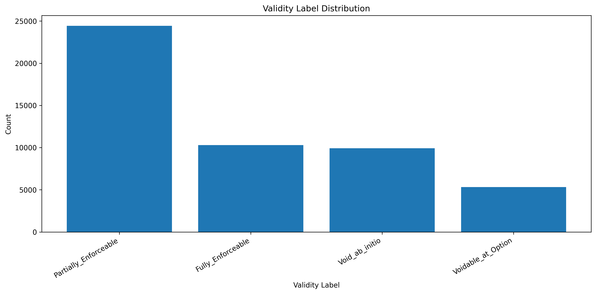
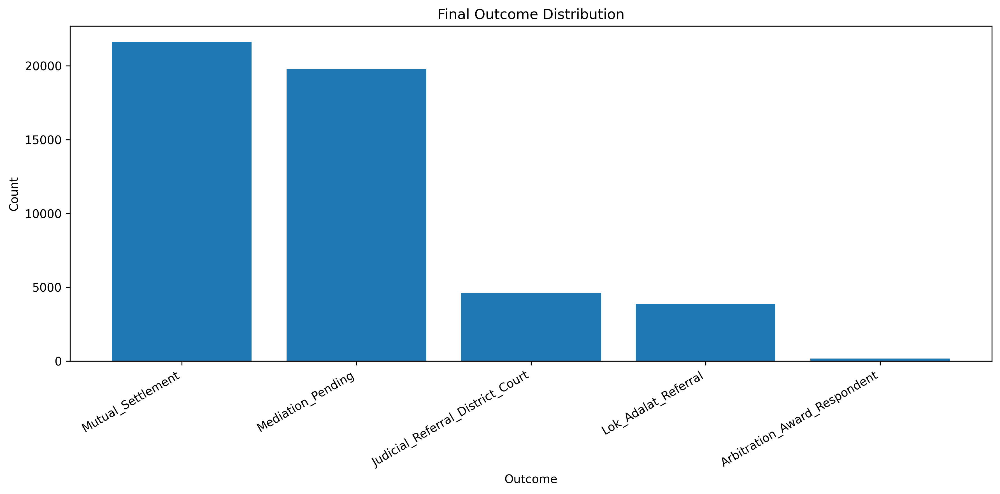
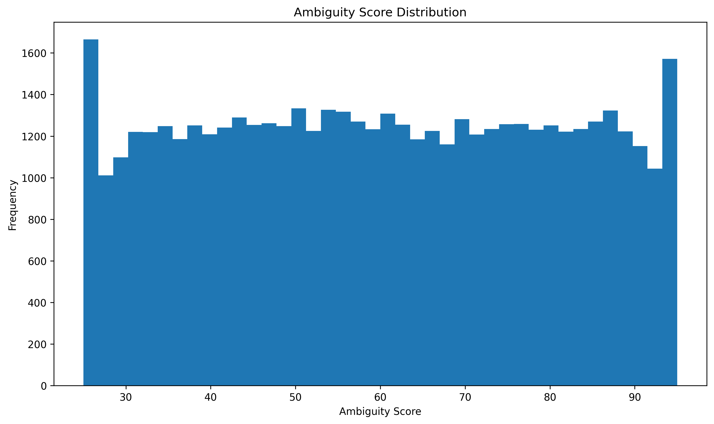
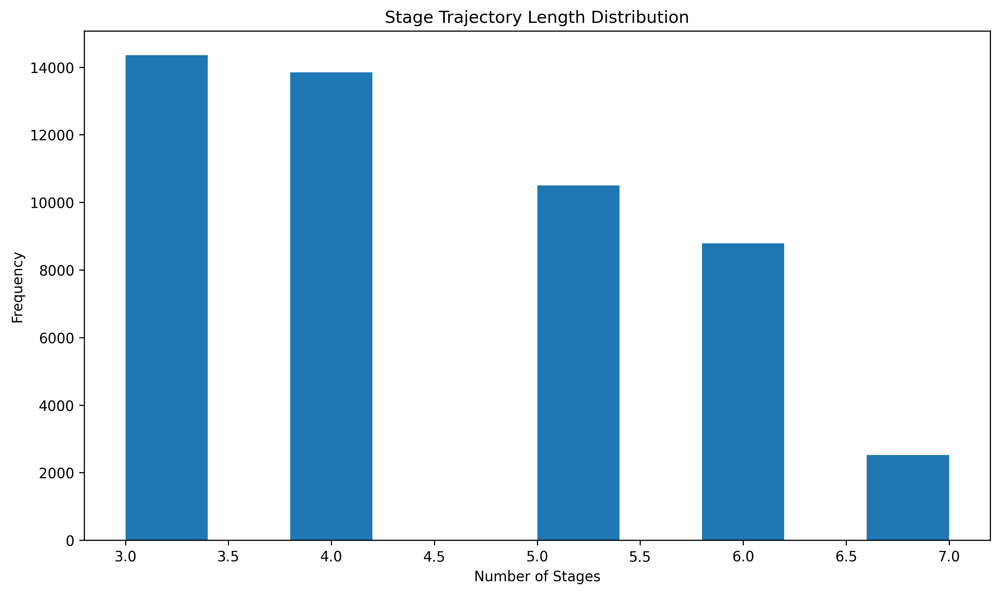
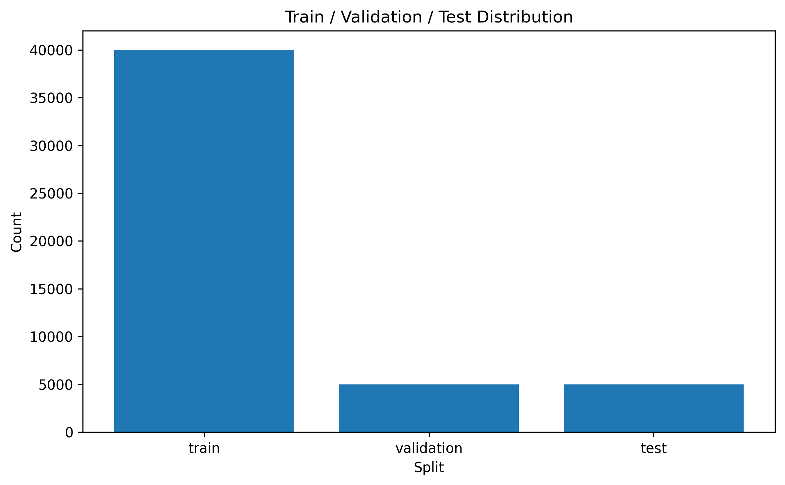
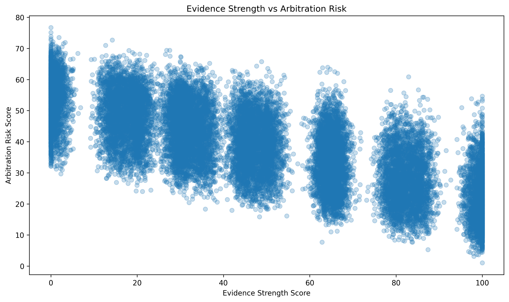
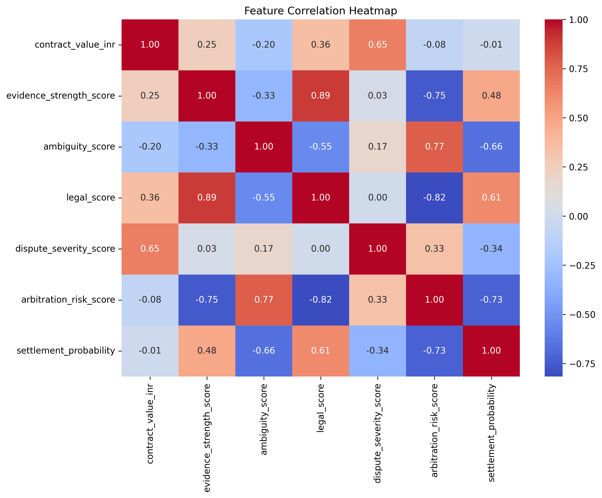

<div align="center">

# HinglishContractFlow

### Large-Scale Benchmark for Contract Intelligence, Arbitration Analytics, and Code-Mixed Legal Reasoning

<br>


</div>

---

## Overview

HinglishContractFlow is a large-scale benchmark dataset designed for legal AI, contract intelligence, dispute resolution modeling, arbitration analytics, and multilingual legal reasoning.

The benchmark captures contractual disputes emerging from India's informal and semi-formal economic sectors, where legal communication frequently combines:

* English legal terminology
* Hindi conversational language
* Regional vernacular expressions
* Informal negotiation practices

Unlike conventional legal datasets that focus on formal contracts or judicial decisions, HinglishContractFlow models complete dispute lifecycles, enabling research into procedural reasoning, negotiation dynamics, legal validity assessment, settlement behavior, and code-mixed legal understanding.

---
## Dataset Access

The complete HinglishContractFlow benchmark dataset is hosted on Hugging Face.

### Hugging Face Repository

https://huggingface.co/datasets/amulyabiradar23/HinglishContractFlow

### Dataset Statistics

| Metric | Value |
|----------|----------|
| Records | 1,000,000 |
| Features | 59 |
| Parquet Files | 40 |
| Size | 595.85 MB |
| Format | Apache Parquet |

The GitHub repository contains documentation, schema definitions, methodology, and exploratory analysis resources, while the benchmark dataset itself is distributed through Hugging Face.
## Why HinglishContractFlow?

Modern legal benchmarks largely focus on:

* Formal English contracts
* Judicial opinions
* Court judgments
* Statutory interpretation

However, a substantial portion of real-world contractual communication occurs in multilingual and code-mixed environments where agreements are negotiated, modified, and disputed through informal legal discourse.

HinglishContractFlow addresses this gap by introducing a benchmark specifically designed for:

### Contract Intelligence

Model contractual obligations, ambiguity, enforceability, and dispute risk.

### Arbitration Analytics

Study escalation behavior, mediation outcomes, and dispute-resolution pathways.

### Procedural Reasoning

Model disputes as evolving processes rather than isolated legal documents.

### Code-Mixed Legal Understanding

Evaluate AI systems under realistic Hinglish legal discourse.

### Explainable Legal AI

Support interpretable legal reasoning through structured legal critic assessments.

---

## Dataset Lifecycle

```text
Contract Formation
        ↓
Clause Ambiguity
        ↓
Disagreement Emerges
        ↓
Negotiation
        ↓
Mediation / Arbitration
        ↓
Resolution Outcome
```

The benchmark models each stage of this lifecycle through structured variables, procedural telemetry, legal reasoning signals, and multi-turn negotiation traces.

---

## Key Statistics

| Metric               | Value          |
| -------------------- | -------------- |
| Total Records        | 1,000,000      |
| Features             | 59             |
| States               | 5              |
| Dispute Categories   | 6              |
| Statutory Frameworks | 59             |
| Dataset Size         | 595.85 MB      |
| Storage Format       | Apache Parquet |
| Parquet Files        | 40             |
| Train Records        | 800,000        |
| Validation Records   | 100,000        |
| Test Records         | 100,000        |

---

## Geographic Coverage

The benchmark models disputes across five Indian jurisdictions.

| State         | Coverage Focus                                 |
| ------------- | ---------------------------------------------- |
| Maharashtra   | Agricultural leasing, logistics, cold storage  |
| Punjab        | Agricultural contracts and machinery leasing   |
| Haryana       | Land-use agreements and logistics partnerships |
| Rajasthan     | Water-sharing and commercial rentals           |
| Uttar Pradesh | Commercial leasing and contractual disputes    |

These jurisdictions introduce diversity in:

* legal context
* statutory frameworks
* dispute characteristics
* linguistic variation
* procedural behavior

---

## Dispute Categories

### Agricultural Lease

Land-use agreements, crop-sharing arrangements, and agricultural tenancy disputes.

### Commercial Rental

Tenancy obligations, security deposits, rental payments, and lease termination conflicts.

### Cold Storage

Storage agreements, liability allocation, release delays, and produce-management disputes.

### Water Sharing

Irrigation access, allocation rights, seasonal resource distribution, and usage disagreements.

### Machinery Lease

Equipment leasing, maintenance responsibility, operational liability, and return-condition disputes.

### Logistics Partnership

Transportation agreements, delivery obligations, distribution partnerships, and cost-sharing conflicts.

---

## Dataset Composition

### Legal Intelligence Features

* Contract validity assessment
* Arbitration risk estimation
* Settlement probability modeling
* Statute-grounded reasoning
* Legal critic evaluations

### Procedural Features

* Multi-stage dispute progression
* Procedural trajectory modeling
* Outcome forecasting
* Mediation workflow analysis

### Linguistic Features

* Hinglish discourse modeling
* Dialect-aware attributes
* Code-switching behavior
* Regional language variation

### Explainability Features

* Critic findings
* Confidence estimates
* Validity labels
* Structured legal reasoning outputs

---

## Dataset Splits

| Split      | Records | Percentage |
| ---------- | ------- | ---------- |
| Train      | 800,000 | 80%        |
| Validation | 100,000 | 10%        |
| Test       | 100,000 | 10%        |

The predefined split assignments are stored directly within the dataset to support reproducible experimentation.
## Working with Dataset Splits

The benchmark stores predefined split assignments directly within the `split` column.

Example:

```python
import pandas as pd

df = pd.read_parquet("chunk_0000.parquet")

train_df = df[df["split"] == "train"]
validation_df = df[df["split"] == "validation"]
test_df = df[df["split"] == "test"]

print(len(train_df))
print(len(validation_df))
print(len(test_df))
```

This design ensures reproducible experimentation while avoiding the need for separate train, validation, and test files.

```
```

---

# Documentation

The repository contains detailed documentation describing benchmark design, schema structure, and generation methodology.

| Document                      | Description                                                                                |
| ----------------------------- | ------------------------------------------------------------------------------------------ |
| `Docs/DATASET_CARD.md`        | Comprehensive dataset overview, intended uses, limitations, and benchmark characteristics  |
| `Docs/DATA_DICTIONARY.md`     | Complete feature-level schema documentation for all 59 columns                             |
| `Docs/METHODOLOGY.md`         | Generation pipeline, procedural simulation, statistical modeling, and validation framework |
| `Docs/dataset_statistics.csv` | Dataset-level statistical summary                                                          |
| `Docs/dataset_summary.json`   | Machine-readable benchmark metadata                                                        |

---

# Exploratory Data Analysis

The repository includes a collection of exploratory visualizations describing benchmark structure, statistical properties, and target distributions.

## Validity Label Distribution



---

## Outcome Distribution



---

## Ambiguity Score Distribution



---

## Stage Length Distribution



---

## Dataset Split Distribution



---

## Evidence Strength vs Arbitration Risk



---

## Feature Correlation Analysis



---

# Benchmark Tasks

HinglishContractFlow supports multiple legal AI and contract intelligence tasks.

## Classification Tasks

### Contract Validity Prediction

Predict:

* Fully_Enforceable
* Partially_Enforceable
* Voidable_at_Option
* Void_ab_initio

using structured dispute information and negotiation traces.

---

### Outcome Prediction

Predict final dispute outcomes from legal, procedural, and linguistic signals.

Examples include:

* Mutual_Settlement
* Mediation_Pending
* Lok_Adalat_Referral
* Judicial_Referral_District_Court

---

### Difficulty Classification

Estimate overall dispute complexity.

Examples:

* Easy
* Medium
* Hard

---

## Regression Tasks

### Arbitration Risk Estimation

Predict:

```text
arbitration_risk_score
```

---

### Settlement Probability Prediction

Predict:

```text
settlement_probability
```

---

## Retrieval Tasks

### Statute Retrieval

Identify the most relevant statutory framework from dispute context.

Target:

```text
applicable_statute
```

---

## Generation Tasks

### Legal Critic Generation

Generate legal findings and reasoning explanations.

Target:

```text
critic_finding
```

---

### Negotiation Understanding

Model and analyze multi-turn dispute conversations stored within:

```text
negotiation_trace_json
```

---

## Multilingual Legal Reasoning

Evaluate AI systems under realistic Hinglish legal discourse using:

* linguistic_mix_ratio
* regional_dialect
* code-switching behavior
* negotiation traces

---

# Quick Start

## Loading the Dataset

```python
import pandas as pd

df = pd.read_parquet(
    "chunk_0000.parquet"
)

print(df.head())
```

---

## Inspect Dataset Splits

```python
print(df["split"].value_counts())
```

Expected distribution:

```text
train         800000
validation    100000
test          100000
```

---

## Example Features

```python
columns = [
    "state",
    "dispute_type",
    "ambiguity_score",
    "evidence_strength_score",
    "validity_label",
    "final_outcome"
]

print(df[columns].head())
```

---

# Research Applications

HinglishContractFlow is designed for research in:

### Legal AI

* Contract Intelligence
* Legal Reasoning
* Statute Retrieval
* Explainable Legal Systems

### Arbitration Analytics

* Escalation Forecasting
* Settlement Prediction
* Dispute Resolution Modeling

### Natural Language Processing

* Hinglish NLP
* Code-Mixed Understanding
* Legal Dialogue Modeling

### Agentic Systems

* Autonomous Mediation
* Legal Copilots
* Multi-Agent Negotiation Systems

### Responsible AI

* Explainability
* Confidence Estimation
* Interpretable Decision Support
---

